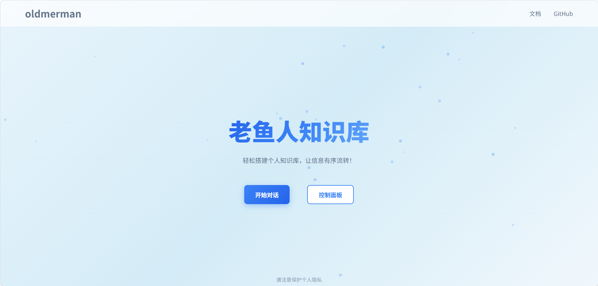

# oldmerman-assistant

**oldmerman-knowledge** 的前端实现。基于 Vue 3 + TypeScript + Vite 构建的知识库管理系统。

前端**大部分**使用AI生成，只有很少一部分个人微调(提示词在`src\.doc`下)，后端仓库: https://github.com/oldMerm/oldmerman-knowledge。



## 开发命令

```sh
pnpm install       # 安装依赖
pnpm dev       # 启动开发服务器（http://localhost:5173）
pnpm run build     # 类型检查 + 生产构建
```

## 后端联调
URL位置：`src\utils\http.ts`中的`API_BASE_URL`

## email
鄙人不才，望共勉之~~你的一个⭐是我最大的动力😏！！！

**outlook**: `oldmerman@outlook.com`

**qq**: `oldmerman@qq.com`(使用较多)